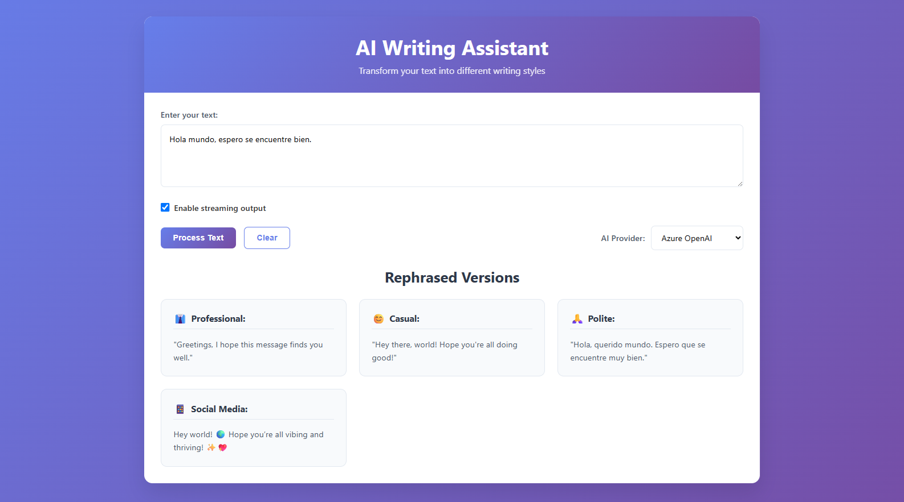

# 📝 AI Writing Assistant



## Versión en Español

Una aplicación full-stack que utiliza GPT de OpenAI para reformular texto en diferentes estilos de escritura (Profesional, Casual, Cortés, Redes Sociales).

### Características

#### Características Base ✅
- **Frontend**: ReactJS con hooks y componentes modernos
- **Backend**: FastAPI con Python
- **Integración AI**: OpenAI gpt-4o-mini
- **Estilos de Escritura**: Profesional, Casual, Cortés, Redes Sociales
- **Control de Procesos**: Deshabilitar entrada durante procesamiento, botón de cancelar
- **Manejo de Errores**: Manejo elegante de errores y retroalimentación al usuario

#### Características Adicionales ✅
- **Salida en Streaming**: Generación de texto en tiempo real palabra por palabra
- **Áreas de Texto Separadas**: Cada estilo de escritura en su propia área dedicada
- **UI de Grado Producción**: Diseño limpio, moderno y responsivo
- **Características de Framework Moderno**: React hooks, async/await, ES6+ moderno
- **Arquitectura Modular**: Componentes y servicios bien estructurados
- **Pruebas**: Pruebas unitarias y de integración
- **Contenedorización**: Soporte Docker para backend
- **Accesibilidad**: Etiquetas ARIA, navegación por teclado, soporte de alto contraste

### Stack Tecnológico

#### Backend
- **FastAPI**: Framework moderno de Python para APIs
- **OpenAI**: LLM (ej. gpt-4o-mini) para procesamiento de texto
- **Pydantic**: Validación de datos
- **Pytest**: Framework de pruebas
- **Docker**: Contenedorización

#### Frontend
- **React 18**: Frontend moderno con hooks

### 🔧 Requisitos Previos
- Python 3.11+
- Node.js 16+
- Docker (opcional, pero recomendado para el backend)
- Variables de entorno de **Azure OpenAI**, **OpenAI** y **Anthropic (Claude)** configuradas en `.env` en la carpeta **backend** (no incluidas en el repo):

```env
AZURE_OPENAI_API_KEY=''
AZURE_OPENAI_ENDPOINT=''
AZURE_OPENAI_DEPLOYMENT='gpt-4o-mini'
OPENAI_API_KEY=''
OPENAI_MODEL='gpt-4o-mini'
ANTHROPIC_API_KEY=''
CLAUDE_MODEL='claude-sonnet-4-20250514'
```

### ⚙️ Instrucciones de Instalación y Ejecución

#### 1. Clonar el repositorio
```bash
git clone https://github.com/LxMera/writing_assistant.git
```

#### 2. Backend, Frontend y Nginx
Desde la raíz del proyecto (writing_assistant):

```bash
docker compose up --build
```

La aplicación quedará disponible en: http://localhost

Inicialmente solicitará el usuario y contraseña, que para este ejemplo práctico son: `admin` y `admin123`

Una vez realizado el login se accederá a la interfaz, tal como se muestra en la imagen.

---

## English Version

A full-stack application that uses OpenAI's GPT to rephrase text in different writing styles (Professional, Casual, Polite, Social Media).

### Features

#### Base Features ✅
- **Frontend**: ReactJS with modern hooks and components
- **Backend**: FastAPI with Python
- **AI Integration**: OpenAI gpt-4o-mini
- **Writing Styles**: Professional, Casual, Polite, Social Media
- **Process Control**: Disable input during processing, cancel button
- **Error Handling**: Graceful error handling and user feedback

#### Bonus Features ✅
- **Streaming Output**: Real-time text generation with word-by-word streaming
- **Separate Text Areas**: Each writing style in its own dedicated area
- **Production-Grade UI**: Clean, modern, responsive design
- **Modern Framework Features**: React hooks, async/await, modern ES6+
- **Modular Architecture**: Well-structured components and services
- **Testing**: Unit and integration tests
- **Containerization**: Docker support for backend
- **Accessibility**: ARIA labels, keyboard navigation, high contrast support

### Tech Stack

#### Backend
- **FastAPI**: Modern Python framework for APIs
- **OpenAI**: LLM (e.g., gpt-4o-mini) for text processing
- **Pydantic**: Data validation
- **Pytest**: Testing framework
- **Docker**: Containerization

#### Frontend
- **React 18**: Modern frontend with hooks

### 🔧 Prerequisites
- Python 3.11+
- Node.js 16+
- Docker (optional, but recommended for backend)
- **Azure OpenAI**, **OpenAI**, and **Anthropic (Claude)** environment variables configured in `.env` in the **backend** folder (not included in the repo):

```env
AZURE_OPENAI_API_KEY=''
AZURE_OPENAI_ENDPOINT=''
AZURE_OPENAI_DEPLOYMENT='gpt-4o-mini'
OPENAI_API_KEY=''
OPENAI_MODEL='gpt-4o-mini'
ANTHROPIC_API_KEY=''
CLAUDE_MODEL='claude-sonnet-4-20250514'
```

### ⚙️ Installation and Execution Instructions

#### 1. Clone the repository
```bash
git clone https://github.com/LxMera/writing_assistant.git
```

#### 2. Backend, Frontend, and Nginx
From the project root (writing_assistant):

```bash
docker compose up --build
```

The application will be available at: http://localhost

Initially, it will request username and password, which for this practical example are: `admin` and `admin123`

Once logged in, you will access the interface as shown in the image.